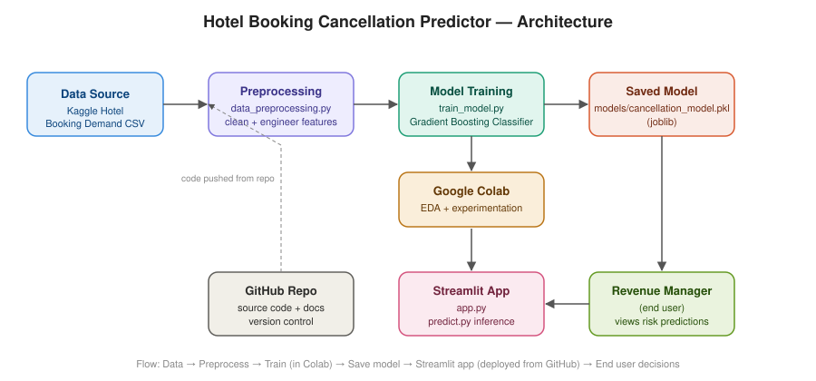

# 🏨 Hotel Booking Cancellation Predictor

AI-powered decision-support tool that predicts the probability a hotel booking
will be cancelled — helping revenue managers make smarter overbooking,
follow-up, and staffing decisions.



---

## Project Case Study

1. **Industry**: Travel / Hospitality / Hotel Revenue Management
2. **Company Examples**: OYO, Marriott, Taj Hotels, Booking.com, MakeMyTrip, Airbnb
3. **Business Background**: Hotels manage revenue through booking volume and room inventory, but cancellations (often free, up to the last minute) create unpredictable gaps in occupancy that are hard to plan around.
4. **Business Problem**: Revenue managers don't know in advance which bookings are likely to cancel, so they either under-book (leaving rooms empty when cancellations happen) or over-book blindly (risking walk-away guests when cancellations don't happen).
5. **Why Existing Solutions Fail**: Most hotel PMS (property management systems) show cancellation history and aggregate rates but don't score individual upcoming bookings for cancellation risk — so overbooking decisions are based on rough averages, not booking-specific signals (lead time, deposit type, guest history, channel).
6. **Business Impact**: Revenue loss from empty rooms or guest walk-aways and reputational damage, inefficient staffing/housekeeping planning, poor forecast accuracy for revenue management.
7. **Problem Statement**: Build a model that predicts the probability a specific hotel booking will be cancelled, using booking, guest, and stay-characteristic features, to support smarter overbooking and revenue-management decisions.
8. **Business Objectives**: Reduce revenue loss from cancellations, improve occupancy forecast accuracy, optimize overbooking strategy, reduce both empty-room loss and walk-away incidents.
9. **Functional Requirements**: Ingest booking data, compute cancellation-risk score per booking, flag high-risk bookings, recommend overbooking threshold per date, dashboard for revenue managers.
10. **Non-Functional Requirements**: Fast scoring at booking time, scalable across multiple properties, explainable risk drivers, secure handling of guest data.
11. **Data Required**: Historical booking records (lead time, arrival date, deposit type, market segment, previous cancellations, room type, ADR). **Dataset: [Kaggle — Hotel Booking Demand](https://www.kaggle.com/datasets/jessemostipak/hotel-booking-demand)**.
12. **Suggested Tech Stack**: Python, Pandas, Scikit-learn, Streamlit, Plotly, joblib, GitHub.
13. **AI/ML Concepts**: Binary classification, feature engineering, imbalanced-class handling, model explainability, threshold tuning.
14. **KPIs**: Cancellation prediction AUC ≥ 85%, revenue-loss reduction ≥ 10%, occupancy forecast accuracy improvement.
15. **Business Outcome**: Higher realized occupancy and revenue, fewer costly walk-aways, better staffing/resource planning, more accurate revenue forecasting.
16. **Expected Deliverables**: Working Streamlit app, source code, README, presentation, architecture diagram, dataset/API documentation, video walkthrough, social media post.

> **Disclaimer**: This is an educational/demo decision-support tool, not a certified production revenue-management system. Do not use real, unlicensed hotel booking data.

---

## Project Structure

```
hotel-cancellation-predictor/
├── app.py                        # Streamlit application (entry point)
├── requirements.txt
├── .env.example
├── .gitignore
├── README.md
├── assets/
│   └── architecture_diagram.svg
├── data/
│   └── hotel_bookings.csv        # <- place the real Kaggle dataset here (not committed)
├── models/
│   ├── cancellation_model.pkl    # trained pipeline (generated)
│   └── metrics.json              # evaluation metrics (generated)
├── notebooks/
│   └── eda_and_training.ipynb    # Google Colab notebook: EDA + model training
└── src/
    ├── data_preprocessing.py     # cleaning + feature engineering
    ├── train_model.py            # training script (CLI)
    ├── predict.py                # inference helper used by app.py
    └── generate_sample_data.py   # synthetic data for pipeline testing only
```

---

## Getting the Real Dataset

1. Download **Hotel Booking Demand** from Kaggle:
   https://www.kaggle.com/datasets/jessemostipak/hotel-booking-demand
2. Save the CSV as `data/hotel_bookings.csv` in this repo (this path is
   gitignored — you'll upload it yourself, not commit it).

Alternatively, for a quick pipeline smoke test without downloading anything:
```bash
python src/generate_sample_data.py --n 3000 --out data/sample_hotel_bookings.csv
```
This produces **synthetic** data matching the same schema — useful to verify
the pipeline runs, but **not** to be used for your reported project results.

---

## Local Setup

```bash
# 1. Clone the repo
git clone https://github.com/<your-username>/hotel-cancellation-predictor.git
cd hotel-cancellation-predictor

# 2. Create a virtual environment (recommended)
python -m venv venv
source venv/bin/activate   # Windows: venv\Scripts\activate

# 3. Install dependencies
pip install -r requirements.txt

# 4. Add the real dataset
#    place hotel_bookings.csv in data/

# 5. Train the model
python src/train_model.py --data data/hotel_bookings.csv

# 6. Run the app
streamlit run app.py
```

---

## Google Colab Workflow

Use `notebooks/eda_and_training.ipynb` for exploratory data analysis and
model experimentation:

1. Open the notebook in Google Colab.
2. Upload `hotel_bookings.csv` when prompted (or mount Google Drive).
3. Run all cells — it covers EDA, feature engineering, model comparison, and
   evaluation.
4. Download the trained `cancellation_model.pkl` and place it in `models/`
   before running the Streamlit app locally, **or** re-run
   `src/train_model.py` locally for a repo-native artifact.

---

## Deploying to Streamlit Community Cloud

1. Push this repo to your own GitHub account (see below).
2. Go to https://share.streamlit.io and sign in with GitHub.
3. Click **New app**, select this repo, branch `main`, and set the main file
   path to `app.py`.
4. **Important**: Streamlit Cloud needs `models/cancellation_model.pkl` to
   exist in the repo (the real dataset itself is gitignored, but the trained
   model artifact should be committed so the deployed app has something to
   load). Either:
   - Train locally and `git add -f models/cancellation_model.pkl models/metrics.json`, or
   - Add a small build step that trains on first run (not recommended for a
     hobby-tier deployment due to cold-start time).
5. Deploy. Your app will be live at `https://<your-app-name>.streamlit.app`.

---

## Pushing to GitHub

```bash
cd hotel-cancellation-predictor
git init
git add .
git commit -m "Initial commit: hotel booking cancellation predictor"
git branch -M main
git remote add origin https://github.com/<your-username>/hotel-cancellation-predictor.git
git push -u origin main
```

---

## Do's and Don'ts Followed in This Project

**Do's**
- Requirement/case-study document included above before any code was written.
- Git-ready structure with `.gitignore` for secrets and large/licensed data.
- Modular, documented code (`src/` split by responsibility).
- Input validation in the Streamlit UI (bounded sliders/selects) and
  exception-safe model loading (`app.py` checks for missing model file).
- Clean, functional UI with tabs, metrics, and clear recommendations.
- Pipeline tested end-to-end (synthetic data → train → predict → app) before
  handing off.
- Architecture diagram included (`assets/architecture_diagram.svg`).

**Don'ts**
- No hardcoded secrets — `.env.example` provided, `.env` gitignored.
- No fabricated "real" results — synthetic data is explicitly labeled as
  pipeline-testing-only throughout the code and this README.
- Real dataset is not bundled (Kaggle license/size) — clear download
  instructions provided instead.
- `reservation_status` / `reservation_status_date` are explicitly dropped in
  `data_preprocessing.py` to avoid label leakage (they directly encode the
  outcome we're predicting).

---

## Next Steps for Your Submission

- [ ] Download the real Kaggle dataset and train the production model
- [ ] Record your 15–20 min video walkthrough (code + live demo)
- [ ] Build your presentation deck from this README's case-study section
- [ ] Deploy to Streamlit Community Cloud and confirm the public link works
- [ ] Post on social media with the required tags, and save a screenshot as
      evidence
